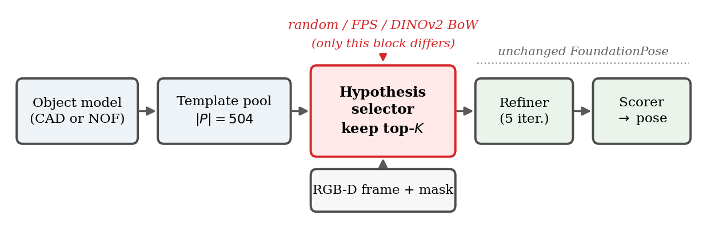
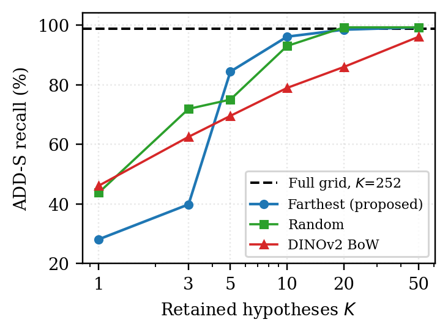
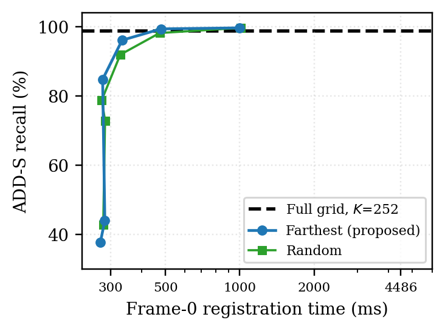

# Farthest-Point Hypothesis Pruning for Fast Frame-0 Registration in FoundationPose

How many pose hypotheses does FoundationPose actually need on the first frame — and how should they be chosen?

FoundationPose registers a novel object by refining and scoring a fixed grid of **252 pose hypotheses**, and this single step dominates initialization latency. We keep the pool of rendered templates fixed and change **only the rule that selects K of them**, then measure what that costs in accuracy and time.

<p align="center">
  
</p>

## Key results

Three selectors, identical FoundationPose refiner and scorer, 21 YCB-Video objects, ADD/ADD-S against ground truth:

| Selector | Uses image | ADD-S @ K=20 | Verdict |
|---|---|---|---|
| Full grid (K=252) | no | 98.8 % | baseline, 4486 ms |
| **Farthest-point sampling (FPS)** | no | **99.4 %** | ~9× faster, best trade-off |
| Random | no | 98.2 % | surprisingly strong |
| DINOv2 bag-of-words retrieval | yes | 85.9 % | **worse than random** |

- **FPS at K=20 reaches 97.5 % ADD-S against the full grid's 98.8 % on a matched object set, about 9× faster**, and equals the grid (98.8 %) at K=50 while still being 4.5× faster.
- **Negative result:** DINOv2 bag-of-words retrieval underperforms even random selection for K ≥ 5. Bag-of-words ranking is not viewpoint-discriminative — it clusters hypotheses by appearance instead of covering the rotation space.
- Registration time is approximately linear, **t ≈ 192 + 17.0·K ms** (NVIDIA Tesla T4).

<p align="center">
  
  
</p>

### Why coverage beats appearance ranking

The refiner only converges from a hypothesis that is already close to the truth, so accuracy is governed by the **covering radius** of the retained set on SO(3). Measured directly on the 504-pose pool:

| K | 3 | 5 | 10 | 20 |
|---|---|---|---|---|
| Farthest | 180° | **112°** | **94°** | **68°** |
| Random | 168° | 149° | 122° | 100° |

The crossover at K=5 matches the accuracy crossover exactly — FPS is worse at K≤3 because pushing a few poses maximally apart leaves a 180° gap, and better from K≥5 onward.

## Repository layout

```
paper/          IEEE-format paper (LaTeX source + figures + compiled PDF)
abstract/       Standalone abstract for conference submission
code/           Jupyter notebooks (experiments) + figure scripts
results/        Raw measurement CSVs
```

| Path | Contents |
|---|---|
| `paper/main.tex` | full paper, self-contained (no `IEEEtran.cls` needed) |
| `paper/paper.pdf` | compiled, 6 pages |
| `code/pruning_study.ipynb` | main experiment: random / farthest / DINOv2 BoW harness |
| `code/model_based_dinov2.ipynb` | DINOv2 template bank + BoW retrieval, model-based |
| `code/model_free_dinov2.ipynb` | same, model-free (neural object field) |
| `code/make_figures.py` | regenerates Figs. 3–6 from `results/*.csv` |
| `code/make_figures_extra.py` | regenerates pipeline diagram and covering-radius figure |
| `results/breadth.csv` | 21 objects × {random, farthest} × K sweep |
| `results/decisive_ob*.csv` | 8 objects × all three selectors |
| `results/anchor_full.csv` | full-grid (K=252) anchor, 5 objects |

## Reproducing

**Figures** — needs only the CSVs in this repo:

```bash
pip install pandas matplotlib numpy opencv-python trimesh
python code/make_figures.py
python code/make_figures_extra.py
```

**Paper** — compile with **XeLaTeX** (required: the author names use Vietnamese diacritics via `fontspec`):

```bash
cd paper
xelatex main.tex && xelatex main.tex
```

On Overleaf: Menu → Compiler → **XeLaTeX**.

**Experiments** — the notebooks are written for Google Colab and expect a working
[FoundationPose](https://github.com/NVlabs/FoundationPose) install plus the YCB-Video
reference views. Object meshes and RGB-D frames are not redistributed here.

## Method in one paragraph

Render the object from 42 icosphere viewpoints × 12 in-plane rotations (504 templates). At the first frame, select K of those poses and hand them to the unchanged FoundationPose refiner (5 iterations) and scorer. Geodesic farthest-point sampling picks the K poses that maximize angular coverage: start from a random template, then greedily add the pose farthest in rotation from the already-selected set. It uses no image features and costs nothing measurable.

## Limitations

Evaluated on YCB-Video only. Timings come from a single Tesla T4 — on a larger GPU the 252-hypothesis batch parallelizes better and the speedup shrinks. The full-grid anchor is measured on 5 objects, so comparisons against it are made on that matched subset. The negative result bounds the **bag-of-words** variant specifically; correspondence-based selectors (FoundPose, GigaPose) that solve PnP retain geometry and are not covered.

## Citation

```bibtex
@misc{fpspruning2026,
  title  = {Farthest-Point Hypothesis Pruning for Fast Frame-0 Registration in FoundationPose},
  author = {Pham, Duc Duong and Hoang, Minh Khoa and Nguyen, Dinh Cao Minh and
            Nguyen, Gia Binh and Tran, Huu Loc and Bien, Minh Tri and Chan, Dai Truyen Thai},
  year   = {2026},
  note   = {Vietnamese-German University}
}
```

## Built on

[FoundationPose](https://github.com/NVlabs/FoundationPose) (Wen et al., CVPR 2024) ·
[DINOv2](https://github.com/facebookresearch/dinov2) ·
[YCB-Video](https://rse-lab.cs.washington.edu/projects/posecnn/)

## Authors

Phạm Đức Dương · Hoàng Minh Khoa · Nguyễn Đình Cao Minh · Nguyễn Gia Bình · Trần Hữu Lộc · Biện Minh Trí · Chan Dai Truyen Thai

Department of Electrical and Computer Engineering, Vietnamese-German University (VGU)
